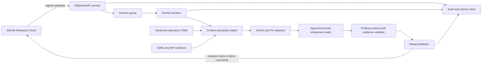

# Project Specification: Project- and Domain-Specific PR Reviewer

## 1. Purpose

Build an AI-assisted pull request reviewer for a consumer-facing distributed commerce platform and an engineering organization of approximately 100 people. The service should identify concrete, high-value defects and risks using both code context and repository-specific architecture and domain guidance. It is an assistant to engineers and human reviewers, not an autonomous approver.

## 2. Goals

- Catch actionable security, privacy, reliability, maintainability, and test/operability risks before merge.
- Apply project-specific knowledge from versioned repository configuration, architecture decision records (ADRs), and API schemas/contracts.
- Understand cross-file and affected-dependency implications in a pull request, not only isolated changed lines.
- Deliver concise, evidence-based findings on relevant changed lines in GitHub Enterprise Cloud.
- Begin with a selected-team pilot and shadow mode, then enable comments after measuring quality.
- Keep source code and model processing within approved enterprise infrastructure.

## 3. Non-Goals for Initial Release

- Approving, rejecting, or blocking pull requests.
- Automatically changing code or creating fix commits.
- Replacing human review, CI tests, static analysis, or security scanners.
- Supporting every language and repository type from day one. Initial language focus is TypeScript/Node.js and infrastructure definitions for Terraform, Kubernetes, and Helm.
- General-purpose code generation unrelated to a pull request.

## 4. Users and Stakeholders

- **Authors:** Receive early, actionable feedback while preparing a pull request.
- **Reviewers:** Use the findings as focused risk signals, retaining responsibility for review decisions.
- **Platform/CI teams:** Integrate, operate, configure, and monitor the service.
- **Delivery leadership:** Assess adoption and quality outcomes across the pilot without treating AI findings as individual performance measures.

## 5. Agreed Requirements

### 5.1 Integrations and workflow

- Target GitHub Enterprise Cloud.
- Support pull-request events and a CI pipeline/check workflow.
- Post inline comments anchored to relevant changed lines when comment mode is enabled.
- Support a shadow mode during the pilot, in which findings are evaluated without posting normal PR comments. The proposed shadow destination is a non-blocking CI check/artifact; confirm the desired visibility with pilot teams.
- Do not gate merges or modify code in the initial release.

### 5.2 Review focus

Prioritize:

- Security and privacy.
- Distributed-system reliability.
- Maintainability where it creates a concrete defect or material risk.
- Test coverage and operability risks.

The reviewer should analyze the full pull request and affected dependencies, with findings anchored to changed lines. Initial stack support is TypeScript/Node.js, Terraform, Kubernetes, and Helm. Relevant platform patterns include microservices/APIs, events and queues, databases and migrations, caches, and search.

### 5.3 Project and domain context

- Each repository maintains reviewer guidance in a versioned YAML configuration file.
- Use repository architecture documentation/ADRs and API schemas/contracts as trusted context sources.
- The initial domain-specific focus is orders, refunds, and cancellations.
- Findings must be concrete and actionable, include severity and confidence, cite relevant changed lines, and explain the rationale. Avoid duplicates and speculative style-only feedback.

### 5.4 Model and security constraints

- Use an approved enterprise model hosted in the company cloud or private network; do not send code to public model endpoints.
- Redact secrets and PII before model requests.
- Maintain an audit trail for reviews and configuration changes.

## 6. Proposed Functional Requirements

1. **Install and authenticate:** Provide a GitHub App installation scoped to selected organizations and repositories, with least-privilege permissions. Validate webhook signatures and reject unauthorized events.
2. **Trigger and deduplicate:** Process opened, reopened, synchronize, and ready-for-review pull-request events. Deduplicate retries and superseded head commits so the same revision does not create duplicate findings.
3. **Collect context:** Retrieve the pull-request diff, relevant surrounding files, repository YAML guidance, referenced ADRs, API contracts, and a bounded set of affected dependencies. Respect file-size and context limits and exclude configured paths.
4. **Classify risk:** Identify changed components and relevant policies before analysis. Apply domain rules only when supported by the available evidence.
5. **Protect data:** Redact secrets and configured sensitive data before sending context to the model. Send only the minimum context needed for review.
6. **Analyze:** Ask the approved enterprise model for candidate findings using structured input and output. Treat repository text and code as untrusted data, not as instructions that can override system policy.
7. **Validate findings:** Validate output against a schema; reject findings without a defensible code location, concrete impact, supported rationale, severity, and confidence. Ensure inline locations map to changed lines where possible. Never present model output as a confirmed fact when evidence is uncertain.
8. **Publish results:** In shadow mode, record the result in the agreed non-blocking CI/check surface without PR inline comments. In comment mode, post concise inline findings and update or resolve the service's prior comments idempotently.
9. **Handle failures safely:** Retry transient GitHub/model failures with bounded backoff. On exhausted retries or unavailable context, report an inconclusive/non-blocking result; do not invent findings or fail the build.
10. **Configure per repository:** Validate the versioned YAML file against a published schema. Invalid or missing configuration must produce a clear diagnostic and fall back to safe organization defaults.
11. **Audit and observe:** Record review ID, repository/PR/revision, triggering event, configuration version, model/version, outcome, timing, and comment/check identifiers. Exclude raw source code, secrets, and unnecessary PII from operational logs.

## 7. Proposed Domain Review Rules

Initial commerce checks should look for evidence of risks such as:

- Refund amounts exceeding captured or refundable amounts, duplicate refunds, or missing idempotency for retryable operations.
- Invalid order state transitions, authorization gaps, or cancellation/refund races.
- Inconsistent updates across order, payment, inventory, and fulfillment services, including missing compensation or reconciliation paths where required by the architecture.
- Event delivery assumptions that fail under retries, duplication, reordering, or partial outages.
- Exposure or unsafe logging of customer, payment, or other sensitive data.
- Contract or schema changes that break consumers or make old/new service versions incompatible.
- Missing tests for failure, retry, duplicate-request, partial-success, and boundary cases.

These are candidate policy areas, not assumptions about the platform's exact implementation. Repository guidance and domain owners must define applicable invariants and exceptions.

## 8. Proposed Finding Format

Each finding should contain:

- Stable finding key for deduplication.
- Repository, pull request, commit SHA, file, and changed-line range.
- Category and severity (for example: critical, high, medium, low).
- Confidence score or band.
- Short title and concise explanation of the concrete failure mode and consumer/platform impact.
- Evidence references to the changed code and relevant project rule or contract.
- Suggested remediation or a focused test when the fix is clear.

Only findings above an agreed confidence threshold should be posted. Initial thresholds should be calibrated in shadow mode; low-confidence observations should be suppressed rather than emitted as comments.

## 9. Proposed Architecture

### 9.1 Component responsibilities

- **Webhook/API service:** Authenticate webhook deliveries, authorize installations, apply rate limits, and enqueue review jobs.
- **Queue and workers:** Isolate webhook response latency from analysis, enforce concurrency and timeouts, and support retries and per-repository fairness.
- **Context/policy loader:** Read the revision-pinned diff and approved repository references, validate YAML, and bound context size.
- **Redaction layer:** Detect/remove secrets and configured sensitive values before model calls; emit redaction metadata without retaining the values.
- **Model adapter:** Call only configured approved private enterprise endpoints, apply timeouts, record model version, and support provider replacement through a stable internal interface.
- **Validator/publisher:** Enforce output schema, evidence and line constraints, confidence policy, deduplication, and shadow/comment mode.
- **Audit/observability:** Store operational metadata and aggregate quality/latency metrics with access controls.

## 10. Repository Configuration

Use a versioned YAML file, with the exact path to be standardized (proposed: `.pr-reviewer.yml`). The schema should support:

- Schema version and enabled review categories.
- High-risk paths, excluded paths, generated files, and supported stack hints.
- Domain invariants and links to approved ADRs/API schemas.
- Explicit service/dependency relationships where repository structure cannot establish them.
- Data classifications and redaction hints without storing credentials.
- Severity/confidence thresholds and comment mode overrides, bounded by organization policy.

Configuration must not permit a repository to disable mandatory organization security controls or select an unapproved model endpoint. Changes to configuration are version-controlled and included in the audit record.

## 11. Security, Privacy, and Governance

- Use GitHub App permissions limited to reading pull requests and repository contents and writing checks/comments only where required. Separate shadow and comment-mode permissions if feasible.
- Store installation credentials and model credentials in a managed secrets service; never in repository configuration or logs.
- Encrypt data in transit and at rest; isolate organization/repository jobs and authorize every GitHub operation against the installation.
- Redact secrets and PII before model inference. Define and test detection coverage, known limitations, and fail-safe behavior.
- Keep source content out of persistent logs by default. Retention duration for prompts, model traces, findings, and audit metadata requires an explicit privacy/security decision.
- Defend against prompt injection in source files, comments, documentation, and generated artifacts. Treat all repository-provided content as data; model output cannot call tools or expand its own permissions.
- Audit access, configuration changes, model/version selection, and published results. Restrict audit access and define retention/deletion policy.
- Perform threat modeling, dependency scanning, and security review before enabling comments broadly.

## 12. Non-Functional Requirements and Initial Targets

Scale and service-level targets were not specified during the interview. The following are provisional engineering targets to validate with the pilot, not agreed commitments:

- Support an organization of approximately 100 people and bursty concurrent pull-request activity through queue-based horizontal scaling.
- Target completion within 5 minutes at the 95th percentile for supported pull requests; measure separately by diff size and model latency.
- Target 99.5% monthly availability for the review service, excluding GitHub and model provider outages.
- Do not block merges or make CI required in the initial release; degraded service must not prevent normal delivery.
- Apply explicit limits for diff size, file count, context tokens, runtime, retries, and per-repository concurrency; report when a review is partial or skipped.
- Keep behavior reproducible enough to audit by recording source revision, configuration version, prompt/rule version, and model version.

## 13. Evaluation and Success Measures

Use a labeled set of historical and synthetic pull requests covering TypeScript/Node.js, infrastructure-as-code, API contracts, and commerce order/refund/cancellation scenarios. Include both true-risk examples and clean changes to measure noise.

Track:

- Precision/actionability of posted findings and false-positive rate, segmented by category and severity.
- Finding acceptance, dismissal, and developer feedback.
- Duplicate-comment rate and percentage of findings anchored to valid changed lines.
- Review completion latency, queue depth, timeout/error rate, and model/GitHub failure rate.
- Coverage of agreed high-risk scenarios and any changes in escaped defects/incidents, interpreted cautiously and not attributed solely to the reviewer.
- Shadow-mode results before enabling comments, with thresholds approved by engineering and security stakeholders.

## 14. Rollout Plan

1. **Discovery and policy definition:** Select pilot repositories, confirm commerce invariants, identify approved model/runtime, define privacy/retention, and agree on evaluation labels.
2. **Foundation:** Implement GitHub App, signed webhook handling, queue/worker pipeline, YAML validation, redaction, audit events, and a non-blocking check surface.
3. **Shadow pilot:** Run on selected teams/repos, make findings visible only in the agreed shadow surface, collect reviewer labels, and tune domain rules and confidence thresholds.
4. **Comment pilot:** Enable inline comments for selected repositories after quality and security criteria are met. Provide repository/team opt-out and feedback controls.
5. **Expansion:** Review metrics and incident feedback with platform, security, product/domain, and delivery stakeholders before expanding repository coverage.

## 15. Acceptance Criteria for Initial Pilot

- GitHub Enterprise Cloud webhook authenticity and installation/repository authorization are verified; unauthorized requests cannot enqueue work or access source.
- Reviews are pinned to a specific pull-request head SHA, deduplicated, and bounded by configured limits.
- Repository YAML is schema-validated and its version is recorded; malformed configuration fails safely with a clear diagnostic.
- Secret/PII redaction runs before any model request, and tests demonstrate that known seeded secrets are not present in outbound model payloads or ordinary logs.
- Only the approved private enterprise model endpoint can be used.
- Candidate findings pass schema, evidence, confidence, and changed-line checks before publication.
- Shadow mode does not post inline comments or block merges; comment mode posts only actionable inline findings and avoids duplicates on reruns.
- Failures are observable and non-blocking to merge; no unsupported finding is fabricated when context or inference is unavailable.
- Pilot evaluation reports precision/actionability, false positives, valid-line anchoring, latency, reliability, and feedback by finding category.
- Security, privacy, and domain owners approve pilot configuration and activation criteria.

## 16. Open Decisions

- Which approved enterprise model/provider, deployment endpoint, and model data-processing terms are available?
- What code, prompt, finding, and audit metadata retention/deletion periods are permitted, and where must data reside?
- Which commerce invariants, service ownership boundaries, event guarantees, and payment/privacy policies are authoritative?
- What are actual pull-request volume, peak concurrency, typical/maximum diff size, and service-level objectives? Validate provisional latency/availability targets.
- Is the organization using GitHub Enterprise Cloud at a configuration that permits the proposed GitHub App/check/comment permissions?
- What exact shadow-mode user experience is preferred: CI check summary, artifact, internal dashboard, or a combination?
- Which source references beyond ADRs and API schemas are required (for example, SLOs, runbooks, service catalog, incident records)?
- Which languages/frameworks beyond TypeScript/Node.js and Terraform/Kubernetes/Helm are in the near-term rollout scope?
- Who owns policy approval, finding-quality adjudication, false-positive escalation, and repository onboarding?
- What measured quality threshold is required before inline comments are enabled?